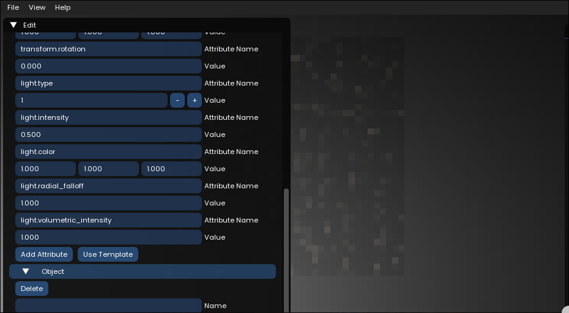

# Vibrant Engine
A rendering engine focused on 2D lighting and the use of normals to create beautiful scenes.

## Features
  * Dynamic Lighting
  * Normal Support
  * Framebuffer Scaling

## Optimization

Vibrant is optimized through and through, with the following notable optimization tricks used

|                          Name                           | Perf. Before | Perf. After |
|---------------------------------------------------------|--------------|-------------|
| Use of C++ (low level language)                         | ---          | ---         |
| Optimized object structure                              | 3.2 GB       | 1.9 GB      |
| Replaced raw pointers with STL                          | 1.9 GB       | 1.8 GB      |
| Cache textures, vertex arrays, GPU buffers              | 1.8 GB       | 420 MB      |
| Cache shaders and return on request                     | 420 MB       | 405 MB      |
| Remove unnecessary data from Texture struct             | 405 MB       | 394 MB      |
| Implement **Deferred Rendering**                        |  ---         | 52 FPS      |
| Remove variables from deferred shaders                  | 52 FPS       | 65 FPS      |
| Used XML for level parsing (+ readability)              | ---          | 58 ms (?)   |
| Used `std::string_view` instead of `std::string`        | ---          | ---         |
| Used const references to minimize copy operations       | 394 MB       | 340 MB      |
| Used std::map in `include/log.h`, O(n^2) time to O(n)   | ---          | ---         |
| Used clang-format and clang-tidy with Google Style      | ---          | + aura      |

*(Tested with a scene with 10000 objects, Rig info: 12900K, RTX 3060, Windows 10 22H2. Averages of 10 runs after stabilizing. Used ImGui to extract FPS info. FPS measurements are the averages of a timespan of 10 seconds (after initialization). Level loading time is extracted from measurements using std::chrono implemented in LoadScene(std::string_view), in src/scene.cc. Level saving time is extracted from measurements using std::chrono implmeneted in SaveScene(const Scene& scene, std::string_view path), in src/scene.cc. Memory usage measurements taken from Task Manager (Windows))*

## Installation
### Linux
1. Install dependencies
`pugixml`
  * Example
`sudo pacman -Sy pugixml` (For Arch Linux)
You will also need `kdialog` OR `xdialog` OR `applescript` for UI input. If you lack any of these, tinyfiledialogs will fall back to console input.
2. Download the latest Linux release from the [releases page](https://github.com/SoHiEarth/vibrant/releases)
3. cd into the folder and run the executable
`cd /path/to/vibrant/executable;./vibrant`
**If the program throws an error complaining about missing dependencies, install them from your distro's package manager.**
### Windows
1. Download the latest Windows release from the [releases page](https://github.com/SoHiEarth/vibrant/releases)
2. Run the executable (`vibrant.exe`)
