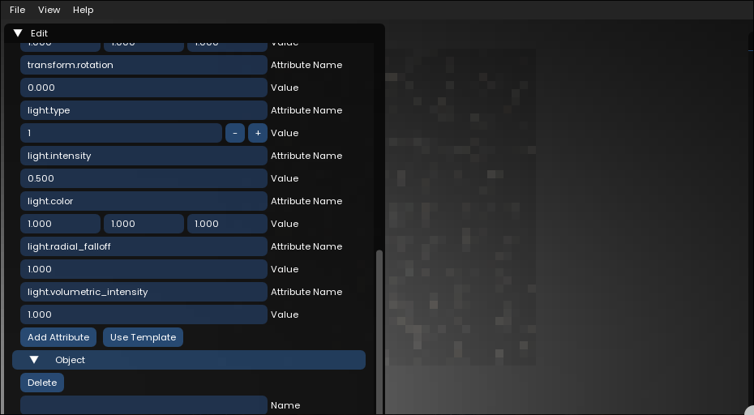

# Vibrant Engine

**A rendering engine focused on 2D lighting and the use of normals to create beautiful scenes.**

---

> [!IMPORTANT]
> Commit times are messed up because of a `git push --force` I did a while ago.
> The project was made across the timespan of January to April 2026, for the "Flavortown"
> YSWS program by Hack Club.

## Features
  * Dynamic Lighting
  * Normal Support
  * Framebuffer Scaling

## Optimization

Vibrant is optimized through and through, with the following notable optimization tricks used:

|                          Name                           |
|---------------------------------------------------------|
| Use of C++ (low level language)                         |
| Optimize object structure                               |
| Replace raw pointers with STL                           |
| Cache textures, vertex arrays, GPU buffers              |
| Cache shaders and return on request                     |
| Remove unnecessary data from Texture struct             |
| Implement Deferred Rendering.                           |
| Remove variables from deferred shaders                  |
| Use XML for level parsing (+ readability)               |
| Use `std::string_view` instead of `std::string`         |
| Use const references to minimize copy operations        |
| Use of `std::map` and `std::unordered_map`              |

## Installation
### Linux
1. Install dependencies
`pugixml`
  * Example
`sudo pacman -Sy pugixml` (For Arch Linux)
You will also need `kdialog` OR `xdialog` OR `applescript` for UI input. If you lack any of these, tinyfiledialogs will fall back to console input.
2. Download the latest Linux release from the [releases page](https://github.com/SoHiEarth/vibrant/releases)
3. cd into the folder and run the executable
`cd /path/to/vibrant/executable;./vibrant`
**If the program throws an error complaining about missing dependencies, install them from your distro's package manager.**
### Windows
1. Download the latest Windows release from the [releases page](https://github.com/SoHiEarth/vibrant/releases)
2. Run the executable (`vibrant.exe`)
